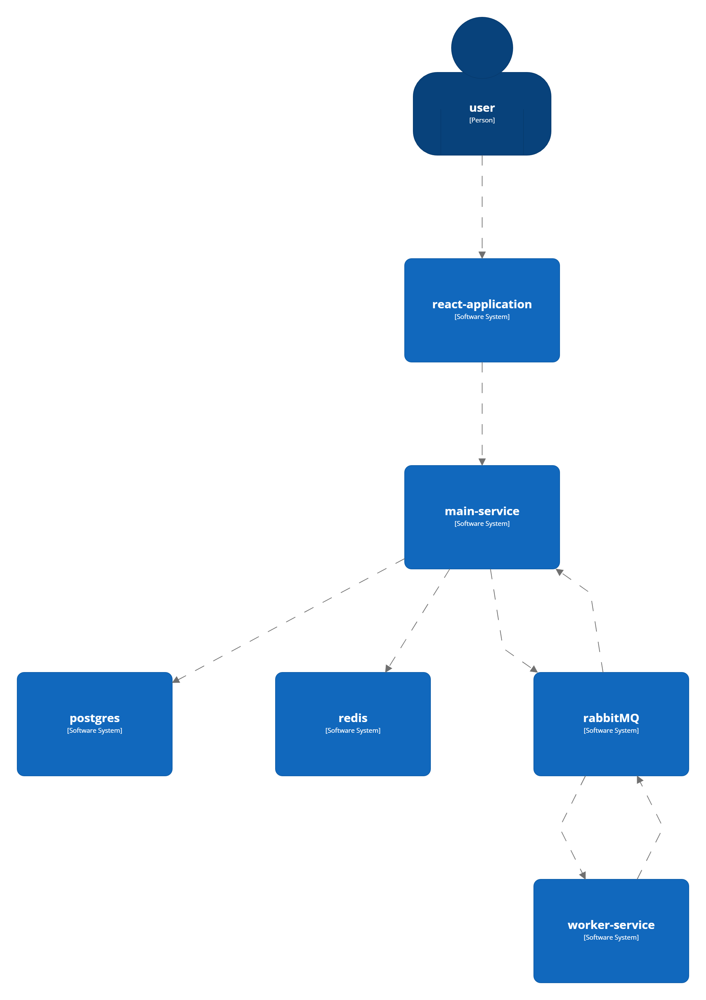
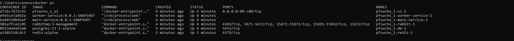
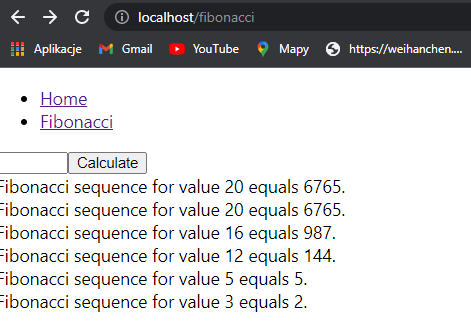

# Development In Cloud - Project 1

## System landscape

## Components

- react-application: User interface

- main-service: Main application service

- redis: Store used for caching fibonacci sequence values

- postgres: Database used for inserting and reading audit data

- rabbitMQ: Message broker

- worker-service: Service responsible for fibonacci sequence calculation

## Running production env

### To run this project in production mode your will need

- Docker

### Instructions

- Go to root project folder
- Type `docker compose up`
- Go to http://localhost/fibonacci to perform calculations
- Go to http://localhost to see documentation

## Running development env

### To run this project in development mode your will need

- Docker

## Instructions

- Go to main-service project folder
- Type `mvnw spring-boot:build-image`
- Go to worker-service project folder
- Type `mvnw spring-boot:build-image`
- Go to root project folder
- Type `docker compose -f docker-compose-dev.yml up`
- Go to http://localhost:3000/fibonacci to perform calculations
- Go to http://localhost:3000 to see documentation

## How hot reloading works?

### JavaScript

webpack-dev-server - development server that provides live reloading.

Instead of creating a bundled file in dist folder, it creates a bundled file in memory. 
It then serves that information to express, and then express creates a web socket connection to render that on the browser on a certain port.

### SpringBoot

spring-boot-devtools is tool that enables automatically restart whenever files on the classpath change.

Remote devtools support is provided in two parts
- server side endpoint that accepts connections
- client application that you run in your IDE. 

The remote client application is designed to be run from within your IDE.
It will monitor your application classpath for changes in the same way as the local restart. Any updated resource will be pushed to the remote application and (if required) trigger a restart.

## ScreenShots

### Docker ps command execution result

### Fibonacci page

